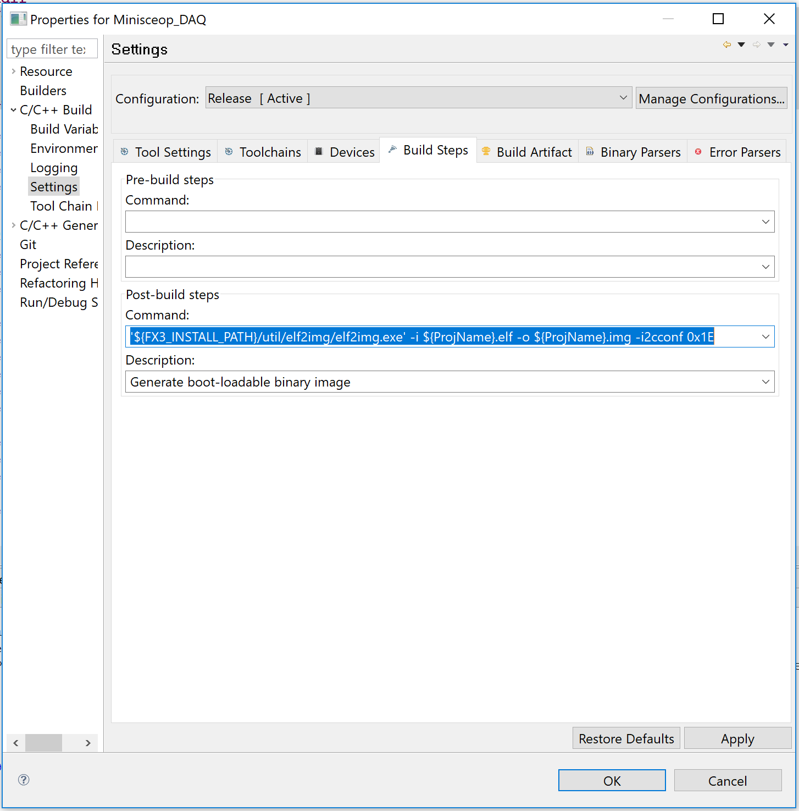
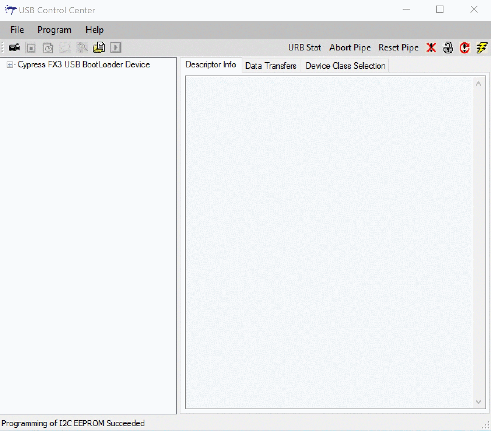

# Miniscope-DAQ-Cypress-firmware
Firmware for the UCLA Miniscope DAQ Box.

The Minsicope DAQ Firmware has been rewritten to both support the new [Miniscope DAQ Software](https://github.com/Aharoni-Lab/Miniscope-DAQ-QT-Software) and to increase its stability and performance. It is based off the [Cypress AN75779](https://www.cypress.com/documentation/application-notes/an75779-how-implement-image-sensor-interface-using-ez-usb-fx3-usb) UVC example project where the generic camera interface has been replaced with a flexible Minsicope interface. **This firmware will only work with the newest Miniscope Software so make sure to use the latest software release.**

This firmware should work on all previously released Miniscope DAQ Boards and Boxes. Pre-built firmware .img files are located in this repository in the "Built_Firmware" folder. ~~You will need to use the firmware file that matches the Miniscope version you will be using. Miniscope V3 is the previously released Miniscope that has a manual focus slider and Objective GRIN lens. Miniscope V4 is our newer Miniscope design with electronic foucs, larger FOV, longer working distance, smaller size (More information can be found on the [Miniscope-v4 repository](https://github.com/Aharoni-Lab/Miniscope-v4).~~ 

This Miniscope DAQ firmware will support all released versions of the Miniscope and Miniscope related devices. No need to reprogram your DAQ anymore when switching between devices! (More information about the Miniscope project can be found on the [Miniscope-v4 repository](https://github.com/Aharoni-Lab/Miniscope-v4)

## Currently supported devices **
* V3 Miniscope 
  * Resolution: 752px X 480px
* V4 Miniscope 
  * Resolution: 608px X 608px
* Minicam
  * Resolution: 2592px X 1944px, 1296px X 972px, 1024px X 768px, 800px X 800px
* MiniLFM v2
  * Resolution: 2592px X 1944px, 1296px X 972px, 1024px X 768px, 800px X 800px
* LFOV Miniscope
  * Resolution: 2592px X 1944px, 1296px X 972px, 1024px X 768px, 800px X 800px

## Setting up the source code and building the firmware

If you are interested in just using the firmware with your Minsicope system, there is no need to download the source code and get it compiling on our own. All you need is the correct pre-build .img file located in the "Built_Firmware" folder in this repository. 

If however you want to built it yourself or make modifications, follow the following steps:

1. Get the [Cypress SDK](https://www.cypress.com/documentation/software-and-drivers/ez-usb-fx3-software-development-kit)
2. Load the project in EZ USB Suite
3. Make sure the "built settings" in the project include the -i2cconf in the elf2img.exe commands. Picture below for reference.

## Programming the Miniscope DAQ Box

### Step 0: Make sure you have Cypress Control Center on your computer.

You will need to use the Cypress Control Center, included in the [Cypress SDK](https://www.cypress.com/documentation/software-and-drivers/ez-usb-fx3-software-development-kit), to upload the firmware image onto the EEPROM memory on the DAQ.

### Step 1: Set the DAQ Jumpers to "Boot from USB"

There are three 2-pin jumprs near the right center of the DAQ PCB. These are label K1, K2, and K3. Placing jumpers across K1 and K2 while leaving K3 empty will put the DAQ in a configuration that will allow us to upload new firmware to the EEPROM.

### Step 2: Plug in the DAQ using a USB 3.0 cable.

When connected to a computer over USB3. The DAQ PCB will power on and it should show up as a Cypress Bootloader in Window's Device Manager.

### Step 3: Open up Cypress Control Center

With the DAQ's jumpers configured correctly and the DAQ plugged in over USB, it shoulw show up in the left column of the Control Center.

### Step 4: Select "Cypress USB Bootloader" then "Program" then "I2C EEPROM" and then select the firmware .img file you want to upload

* You will use the "128K_EEPROM.img" file if you have a v3.2 DAQ (or one with an EEPROM mounted into the 4 x 2 socket on the PCB).
* You will use the "256K_EEPROM.img" file if you have a v3.3 DAQ or MiniDAQ (or any DAQ with a small surface mount EEPROM IC).

The list of currently supported devices are:

### Step 5: Wait about 10 seconds for the message at the bottom of the Cypress COntrol Center to say the the programming was successful

TODO: Add image

### Step 6: Place the jumpers back to configure the DAQ to "Boot from EEPROM", power cycle the DAQ, and check to make sure it shows up in Window;s Device Manager as a "MINISCOPE" under cameras or Imaging Devices.

